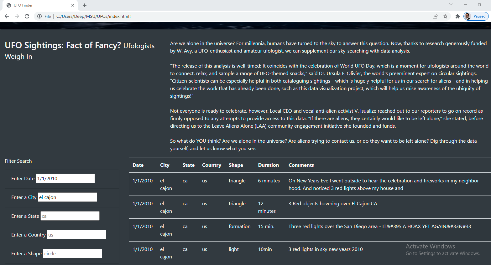
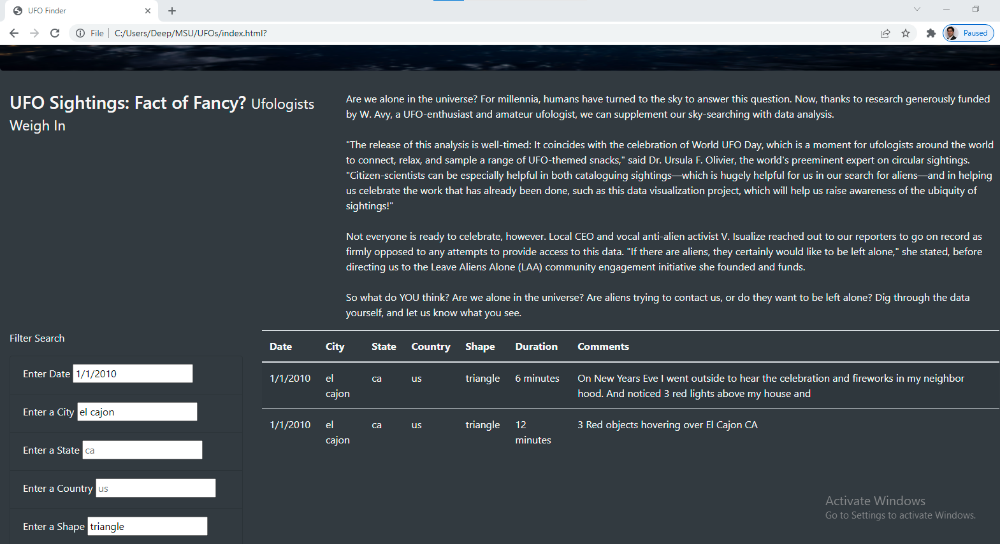

# UFOs
# Module 11 Challenge- _Deliverable 2_

This written analysis contains three sections:

**1. Overview of Project**

**2. Results**

**3. Summary**
 
## 1. Overview of the analysis

The aim of the analysis was to help Dana, who is a data journalist and wants to explore the topic around UFO sightings. She wants to compile an article which would be hosted on a webpage with the functionality of adding in filters as needed. 

For the purposes of the analysis, she intends to get the data in the form of a Javascript and compile a webpage from multiple sources and build-up a filter functionality so users can easily view the information as needed. She also would like to provide a more in-depth analysis of UFO sightings by allowing users to filter for multiple criteria at the same time. In addition to the date, table filters for the city, state, country, and shape were added to the webpage.

## 2. Results

The results primarily highlights the process of using the search criteria in the webpage. 

Lets assume the user wants to view the details of **UFO sightings at El Cajon in California on 1/1/2010 that were triangle-shaped.**

The setps to fiter to this data is as follows:
### **a. Unfiltered view of the webpage:**

The first step is to understand the layout of the webpage as shown in the image below. Below the heading and the description, on the lower left portion of the the screen there is a section called the **Filter Search** with the criteria listed.

*a. Unfiltered Webpage*

### **b. Start typing the filter criterias as applicable:**

Since the first criteria is `Date` and we want to filter the list for a certain date, ie, *1/1/2010*, we can type in the date value in the filter and press `Enter`. The list of sightings immediately updates to only show sightings on 1/1/2010 as shown in the image below,

*b. Date Filter*

### **c. Filter the corresponding City:**

The `el cajon` is typed in the City filter and `Enter` is pressed. Only the sightings in ElCajon on 1/1/2010 are shown *(image below)*,

*c. City Filter*

### **d. Filter the corresponding Shape:**

The `triangle` is typed in the Shape filter and `Enter` is pressed. Only the triangle-shaped sightings in ElCajon on 1/1/2010 are shown *(image below)*,

*d. Shape Filter*

Thus we finally filter the list to two instances of sightings for this particular criteria. It si to be noted, that the filters may be applied in any order as desired.

## 3. Summary

### a. **Drawback of the design: Inputs need to be Case-sensitive and in a certain format**

Although the webapage functions as intended, one drawback of the design is that the inputs need to be case-sensitive and in the same format as the `data.js` file. For example, in the example above, if we had typed in `El Cajon` instead of `el cajon`, the filters would not have worked.

### **b. Recommendations:**

The two recommendations for further development are as follows:
#### *i) Solve for the restrictions around filter Inputs:*

As explained above, the inputs to the filters need to be case-sensitive. Dana would need to solve for this restrictiona and it can be done in multiple ways like, *a) explicitly mentioning the format of the inputs on the filter itself* or *b) If the search encounters an error due to Type mismatch, ensuring the same is shown to the user* or even *c) Using Regex to compensate for any typing mismatches like capitalizing etc.*
#### *ii) Showing the counts of results with each filter:*

Currently there is no easy way to see the number of search results from the filter. This is especially helpful since we have multiple datapoints. Thus adding a section showing the number of results duynamically with each filter would be very helpful.
